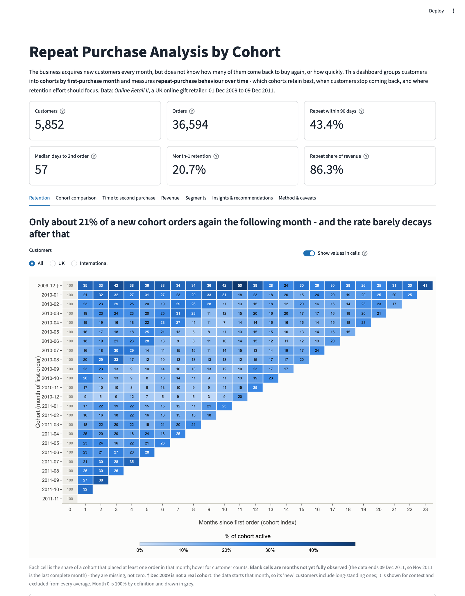
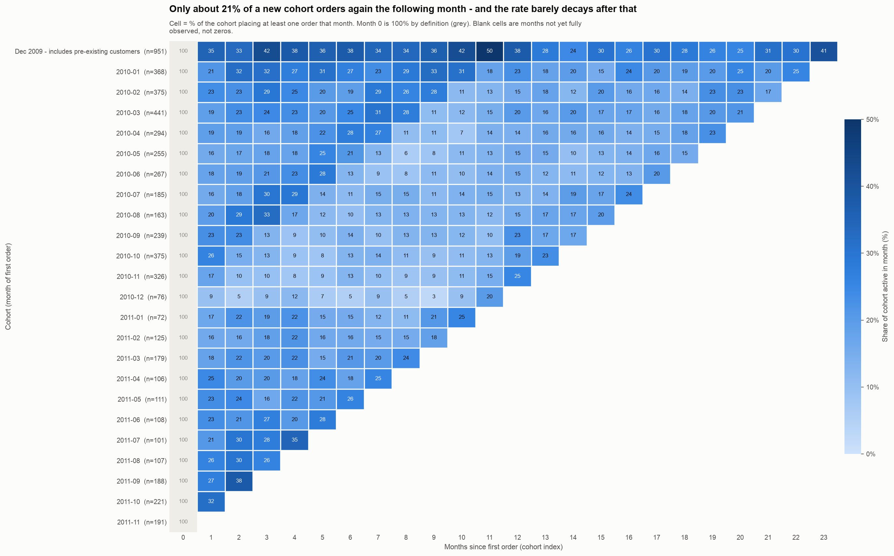
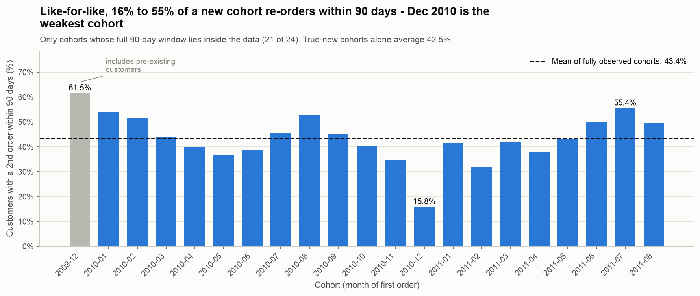
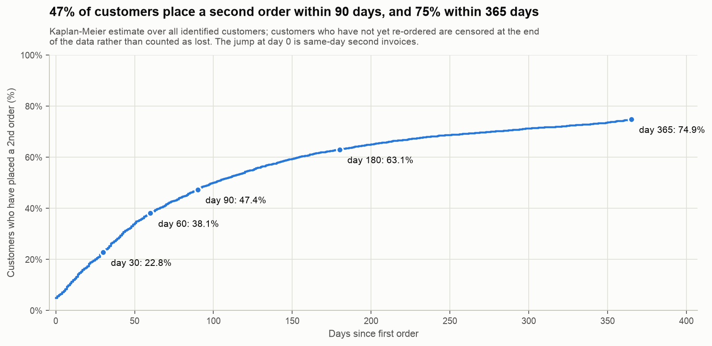
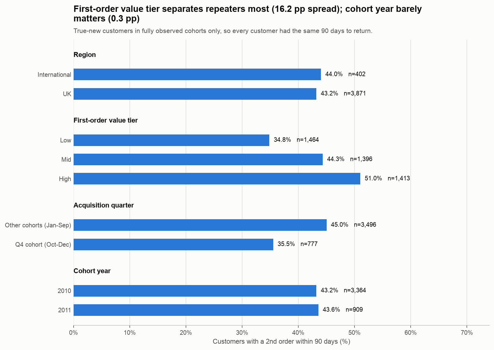
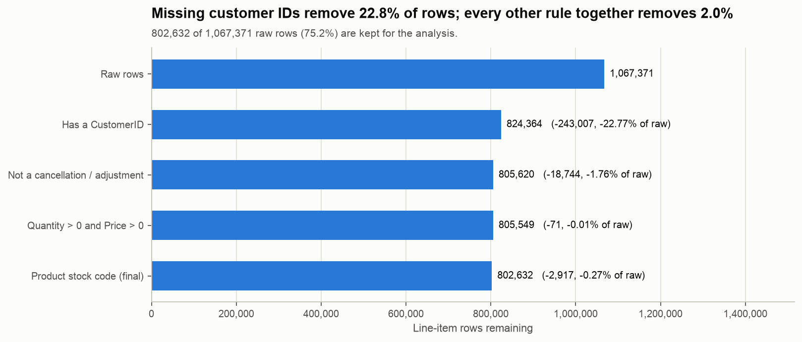

# Repeat Purchase Analysis by Cohort

**How many new customers come back, how fast, and which ones are worth winning?** A cohort retention study of a
UK online gift retailer (Online Retail II, 1.07M transaction rows), with a one-command pipeline, executed
notebooks, a test suite and a deployable Streamlit dashboard.

  

> Every number in this README is produced by code and stored in [`reports/results.json`](reports/results.json).
> Nothing is typed in by hand from memory; re-run `python -m src.run_pipeline` to regenerate all of it.

---

## 1. Problem statement

The business acquires new customers every month, but it does not know how many of them come back to buy again,
or how quickly. Without this view it cannot tell whether newer customers are better or worse than older ones,
when repeat purchases drop off, or which kinds of first-time buyer are worth winning. This project groups
customers into **cohorts by first-purchase month** and measures **repeat-purchase behaviour over time**, to
find which cohorts retain best, when customers stop coming back, and where retention effort should focus.

### The five questions

1. What share of each cohort buys again, and how long does the second purchase take?
2. Do newer cohorts repeat more or less than older ones, compared like-for-like?
3. Where is the biggest drop-off in the customer lifecycle?
4. How much revenue comes from repeat orders versus first orders?
5. Which segments retain best — UK vs international, first-order value tier, Q4 vs other cohorts?

## 2. Key findings

- **The drop-off is in the first month, not later.** Average retention falls **79.3 percentage points** between
  month 0 and month 1, to **20.7%**, then holds roughly level (month 2 is 21.7%, a slight rebound; later months
  stay between 13.7% and 23.2%).
- **43.4% of a new cohort re-orders within 90 days** (mean over the 21 fully observed cohorts; 42.5% over the 20
  true-new ones), and the median repeat customer takes **57 days** to place a second order. By the Kaplan–Meier
  curve, 22.8% of customers have re-ordered by day 30, 47.4% by day 90 and 74.9% within a year.
- **Newer cohorts are neither better nor worse.** Compared like-for-like, 2011 cohorts repeat at 43.6% and 2010
  cohorts at 43.2% — a gap of +0.3 pp (95% CI −3.3 to +4.0), indistinguishable from zero. The apparent decline
  in "% who ever repeated" (91.3% for the first cohort, 28.3% for the last) is an observation-time artefact.
- **Repeat orders are the business: 86.3% of revenue** comes from second and later orders (£15,024,229 of
  £17,410,953 in complete cohorts).
- **First-order value and acquisition season predict repeat behaviour; geography does not.** Repeat-within-90-days
  climbs from 34.8% (low first-order value) to 44.3% (mid) to 51.0% (high). Customers first acquired in Q4
  repeat at 35.5% against 45.0% for the rest (based on the three fully observed Q4 cohorts, all from 2010). UK (43.2%) and international (44.0%) customers show no meaningful
  difference (−0.8 pp, 95% CI −5.9 to +4.3).

## 3. Dashboard



- **Live demo:** _not deployed yet — add your Streamlit Community Cloud URL here after following
  [Deployment](#12-deployment)._
- **Run locally:**

  ```bash
  pip install -r requirements.txt
  streamlit run streamlit_app.py
  ```

The dashboard reads only the small aggregate files in [`app_data/`](app_data) (about 76 KB), never the raw
dataset, so it runs anywhere the repository is cloned. Tabs: Retention · Cohort comparison · Time to second
purchase · Revenue · Segments · Insights & recommendations · Method & caveats.

## 4. Selected figures

**Retention heatmap** — only about one in five new customers orders again the following month, and the rate
barely decays afterwards. The top row (Dec 2009) is not a real cohort; blank cells are unobserved, not zero.



**Repeat-within-90-days by cohort** — the like-for-like metric shows no trend over time; December 2010 is the
weakest cohort (15.8%).



**Time to second order (Kaplan–Meier)** — half of all customers have re-ordered by day 100; the curve is
steepest in the first two months.



**Segments** — first-order value and Q4 timing separate repeaters; region and cohort year do not.



All ten figures are in [`reports/figures/`](reports/figures); the tables behind them are in
[`reports/tables/`](reports/tables).

## 5. Dataset

**Online Retail II** (UCI Machine Learning Repository): every transaction of a UK-based, non-store online
gift-ware retailer between **2009-12-01 and 2011-12-09** — 1,067,371 line-item rows. Many customers are
wholesalers rather than consumers, which matters for interpretation (see [Limitations](#14-limitations)).

The raw file is **not** committed. Download it from UCI or Kaggle and place it anywhere in the project folder as
`online_retail_II.csv` (or the original `online_retail_II.xlsx`); the pipeline finds it automatically.

| Column | Meaning | Notes |
|---|---|---|
| `Invoice` | Order/transaction id | Prefix `C` = cancellation, `A` = adjustment |
| `StockCode` | Product code | 5 digits + optional 1–2 letters = real product; others are fees/postage/samples |
| `Description` | Product name | Has nulls; unused in the analysis |
| `Quantity` | Units on the line | Negative on returns |
| `InvoiceDate` | Timestamp of the order | |
| `Price` | Unit price (£) | Zero on some promotional/bad rows |
| `CustomerID` | Customer identifier | 22.8% of rows are null (guest checkout) — untrackable |
| `Country` | Shipping country | Mostly United Kingdom |

**Citation.** Chen, D. (2012). *Online Retail II* [Dataset]. UCI Machine Learning Repository.
https://doi.org/10.24432/C5CG6D — licensed CC BY 4.0. (Year and DOI checked against the UCI dataset page on
2026-10-01.)

## 6. Definitions

| Term | Definition |
|---|---|
| **Order** | One distinct `Invoice` (its line items summed) |
| **Cohort** | Calendar month of the customer's **first order** |
| **Cohort index** | Whole months between an order's month and the cohort month (0, 1, 2, …) |
| **Active in month N** | Customer placed ≥ 1 order at cohort index N |
| **Retention rate (month N)** | Customers of the cohort active in month N ÷ cohort size |
| **Repeat purchaser** | Customer with ≥ 2 orders |
| **Repeat-within-90-days** | 2nd order placed ≤ 90 days after the 1st ÷ cohort size — **the headline metric** |
| **Repeat-ever** | ≥ 2 orders at any point ÷ cohort size — **biased, context only** (see trap 2) |
| **Days to second purchase** | Calendar days between first and second order dates |
| **First vs repeat revenue** | Revenue from order #1 vs orders #2+ |
| **True-new cohort** | Any cohort after the first month in the data (see trap 1) |

## 7. Method

**Cleaning waterfall.** Four rules, applied in order ([`core.clean`](src/retention/core.py)):

| Step | Rows remaining | Rows removed | % of raw removed |
|---|---:|---:|---:|
| Raw rows | 1,067,371 | — | — |
| Has a `CustomerID` | 824,364 | 243,007 | 22.77% |
| Not a cancellation / adjustment (`C…`, `A…` invoices) | 805,620 | 18,744 | 1.76% |
| `Quantity > 0` and `Price > 0` | 805,549 | 71 | 0.01% |
| Product stock code (final) | **802,632** | 2,917 | 0.27% |

The result: **36,594 orders** from **5,852 customers**, £17,434,450 of revenue, 75.2% of raw rows kept.



**Cohort construction.** Line items are collapsed to one row per invoice (`build_orders`); each customer's
orders are numbered in time order; the month of order #1 is the cohort; the cohort index of any later order is
the whole-month difference. Retention counts *customers*, so two invoices in the same month count once.

**Censoring.** Every time boundary is derived from the data, not hard-coded (`period_bounds`): the first month
(2009-12, left-censored), the last complete month (2011-11) and the data end. Retention cells beyond the last
complete month are `NaN`. The average retention curve uses true-new cohorts only, and for month N only cohorts
that have fully observed month N (at least three of them).

**Why repeat-within-90-days is the headline metric.** "% who ever repeated" is 91.3% for the first cohort and
28.3% for the last — not because customers got worse, but because the first has been watched for two years and
the last for a few weeks. Repeat-within-90-days gives every customer the same 90-day opportunity and is
computed only for cohorts whose last joiner has 90 full days inside the data (21 of 24 cohorts). A Kaplan–Meier
curve complements it by describing *when* customers return while censoring those not yet seen to return. The
self-contained implementation agrees with `lifelines.KaplanMeierFitter` to floating-point precision
(notebook 03).

**Segment comparisons** use repeat-within-90-days on true-new customers in fully observed cohorts, and report
each gap in percentage points with its sample sizes and a normal-approximation 95% confidence interval. A gap
whose interval spans zero is reported as "no meaningful difference".

## 8. Data traps handled

1. **Left-censoring — the first cohort is not a real cohort.** The data begins 2009-12-01, so everyone who
   bought in December 2009 is recorded as "new", including long-standing customers (91.3% repeat-ever against
   28.3% for the last cohort). It is flagged `IsTrueNew = False`, excluded from the retention averages and
   every segment comparison, and labelled explicitly wherever it appears in a chart.
2. **Right-censoring — recent cohorts have had less time.** Cohorts are never ranked on repeat-ever. They are
   compared on repeat-within-90-days (fully observed cohorts only) and described with a Kaplan–Meier curve.
3. **Partial final month.** December 2011 is nine days long. The last complete month (2011-11) is derived in
   code, and later retention cells are masked to `NaN`, never shown as zero.
4. **Non-product lines.** Postage, fees, manual adjustments, samples and test rows are excluded by a
   product-code rule: **2,917 rows, 12 distinct codes, 1.74% of revenue, 26 customers lost entirely.** The codes
   actually removed are `ADJUST`, `ADJUST2`, `BANK CHARGES`, `C2`, `D`, `DOT`, `M`, `PADS`, `POST`, `SP1002`,
   `TEST001`, `TEST002`. **Sensitivity check:** keeping these rows moves repeat-within-90-days from 43.4% to
   44.0% (+0.55 pp, under the 1 pp threshold), the Kaplan–Meier day-90 reading from 47.4% to 47.9% and the
   median days-to-second from 57 to 56 — the choice is **immaterial** to the conclusions.
5. **Cancellations and adjustments** (`C`/`A` invoices) are dropped rather than netted off. Reported revenue is
   therefore **gross of returns**.
6. **Same-day second invoices.** 6.8% of repeat customers place their second order on day 0 — often split or
   corrected orders, not genuine re-purchases. They are kept, and the share is reported wherever the median
   days-to-second is discussed.
7. **Missing customer IDs.** 243,007 rows (22.8%) have no `CustomerID` and cannot be tracked. Retention is
   measured on identified customers only.
8. **Wholesale buyers skew means.** Repeat revenue per repeat customer has a mean of £3,549 but a median of
   £1,002. Medians are used for typical behaviour and for every impact estimate.
9. **Two valid repeat numbers disagree — explained, not hidden.** The cohort-level repeat-within-90-days
   averages **43.4%** while the Kaplan–Meier curve reads **47.4%** at day 90. KM pools all 5,852 customers and
   weights by customer, so it is dominated by the large early cohorts — above all the left-censored December
   2009 cohort; the cohort metric weights each cohort equally and leaves out the three cohorts with incomplete
   windows. Use the cohort metric to compare cohorts and the KM curve to describe timing.

## 9. Recommendations

Each estimate shows its arithmetic. **Read them as orders of magnitude, not forecasts:** uplifts are
illustrative (nothing here was measured in an experiment), values use the **median** repeat revenue per repeat
customer (£1,001.63), and everything is gross revenue — the dataset has no cost, margin, marketing or channel
data. The estimates act on overlapping customers and must not be added together.

| # | Finding → action | Formula and inputs | Estimate |
|---|---|---|---:|
| 1 | Median time to second order is 57 days; 38.1% of customers have re-ordered by day 60. → **Win-back message at about day 35–45**, before the return curve flattens. | `uplift_pp × avg_new_customers_per_month × 12 × median_repeat_revenue` = 0.02 × 211.87 × 12 × £1,001.63 | **≈ £51k / year** (£50,932) |
| 2 | Repeat rate rises with first-order value (34.8% low, 44.3% mid). → **Lift small first baskets** (free-delivery threshold, starter bundles). | `gap_closed_share × (mid_rate − low_rate) × low_tier_share × avg_new_customers_per_month × 12 × median_repeat_revenue` = 0.25 × (0.443 − 0.348) × 0.343 × 211.87 × 12 × £1,001.63 | **≈ £21k / year** (£20,733) |
| 3 | Q4-acquired customers repeat at 35.5% vs 45.0%. → **Dedicated January–February follow-up for Q4 first-time buyers.** | `gap_closed_share × (other_rate − q4_rate) × q4_new_customers_per_year × median_repeat_revenue` = 0.25 × (0.450 − 0.355) × 713.4 × £1,001.63 | **≈ £17k / year** (£16,974) |
| 4 | Retention falls 79.3 pp between month 0 and month 1. → **Concentrate retention effort in the first 30 days** (onboarding, second-order incentive). | `uplift_pp × avg_new_customers_per_month × 12 × median_second_order_value` = 0.02 × 211.87 × 12 × £271.23 | **≈ £14k / year** (£13,791) |
| 5 | Repeat orders generate 86.3% of revenue from 4,234 repeat customers. → **Protect the repeat base** (lapse alerts, account management). | `retained_share × repeat_customers × median_repeat_revenue ÷ years_of_data` = 0.01 × 4,234 × £1,001.63 ÷ 2.02 | **≈ £21k / year** (£20,989) |

**Assumptions.** (1, 4) the 2 pp uplift is illustrative; (2, 3) closing 25% of the observed gap is illustrative,
and the gaps are correlations — a large first order partly identifies a wholesale buyer, and a seasonal gift
buyer may simply not need the product again; (3) the Q4 rate rests on three fully observed Q4 cohorts
(2010-10, 2010-11, 2010-12), a single season; Q4 new customers per year = average true-new Q4 cohort size
(237.8) × 3 months; (4) counts only one extra order at the median second-order value and overlaps with 1;
(5) values keeping 1% of the repeat base from lapsing at the median — losing a large wholesale account costs
far more. New-customer volume is the average true-new cohort size over complete months (211.87, about 212).

## 10. How to run

Tested on macOS (Apple Silicon) with **Python 3.14.7**.

```bash
# 1. Environment
python3 -m venv .venv && source .venv/bin/activate
pip install -r requirements-dev.txt

# 2. Put online_retail_II.csv (or .xlsx) anywhere in the project folder, then rebuild everything
python -m src.run_pipeline                 # about 10 seconds
python -m src.run_pipeline --window 60     # optional: a different repeat window
python -m src.run_pipeline --data-path path/to/online_retail_II.csv

# 3. Tests (tiny hand-checkable data, no dataset needed)
pytest -q

# 4. Notebooks (executed in place, outputs included)
jupyter nbconvert --execute --inplace --ExecutePreprocessor.timeout=600 notebooks/*.ipynb

# 5. Dashboard
streamlit run streamlit_app.py
```

`python -m src.run_pipeline` rebuilds `data/processed/lines.parquet`, every CSV in `reports/tables/`, every PNG
in `reports/figures/`, every file in `app_data/` and `reports/results.json`. It is idempotent: a second run
changes nothing but the `generated_at` timestamp.

| Notebook | Answers |
|---|---|
| [`01_cleaning.ipynb`](notebooks/01_cleaning.ipynb) | Cleaning waterfall, data profile, sensitivity check |
| [`02_cohorts.ipynb`](notebooks/02_cohorts.ipynb) | Retention matrix and heatmap, average curve, biggest drop-off (Q2, Q3) |
| [`03_repeat_behaviour.ipynb`](notebooks/03_repeat_behaviour.ipynb) | Repeat-within-90-days, Kaplan–Meier, days to second order, revenue split (Q1, Q2, Q4) |
| [`04_segments_and_insights.ipynb`](notebooks/04_segments_and_insights.ipynb) | Segment comparisons and recommendations (Q5) |

## 11. Tests

`tests/test_core.py` holds 14 tests on an 11-row toy dataset small enough to check by hand: cleaning drops
exactly the bad rows, orders are one row per invoice, two invoices in one month count once in retention,
month 0 is always 100%, unobserved cells are masked, the first cohort is flagged, the window metric is filled
only for fully observed cohorts, and the survival curve is monotonic.

## 12. Deployment

The dashboard is ready for **Streamlit Community Cloud**; it has not been deployed or pushed anywhere.

1. Create a GitHub repository and push this project (`git remote add origin …`, `git push -u origin main`).
2. Go to [share.streamlit.io](https://share.streamlit.io) → **New app**.
3. Select the repository, branch `main`, and main file `streamlit_app.py`.
4. Deploy. Streamlit Cloud installs `requirements.txt` automatically (streamlit, pandas, numpy, plotly only).

`app_data/` is committed precisely so the deployed app needs no raw data: the 97 MB dataset stays out of the
repository (`.gitignore`), and the dashboard makes no network calls. After changing the analysis, re-run the
pipeline and commit the refreshed `app_data/` and `reports/`.

## 13. Decisions & assumptions

Choices made while building, in the order they came up:

1. **Plan file location.** `PROJECT_PLAN.txt` was supplied outside the project folder; an identical copy is
   kept in the repository as `PROJECT_PLAN.md`. The dataset was read where it was found and never moved,
   renamed or modified.
2. **Python version.** Built and tested on Python 3.14.7 (the `python3` on the machine).
3. **Reference code used as written.** `core.py` contains the plan's reference implementation unchanged; all
   additions sit below a marked "extensions" divider (waterfall table, non-product breakdown, histogram bins,
   segment tables in long form, segment-gap confidence intervals, headline-metric assembly, recommendations).
4. **One extra module, `src/retention/theme.py`.** Colours and fonts shared by the Matplotlib figures and the
   Plotly dashboard live in one dependency-free file so the two cannot drift apart.
5. **Headline mean includes the first cohort, and says so.** The plan's acceptance number for
   repeat-within-90-days (43.4%, range 15.8%–61.5%) averages all 21 fully observed cohorts, *including* the
   left-censored December 2009 cohort that the plan elsewhere says to exclude from averages. The acceptance
   number is kept as the headline and the true-new-only figure (42.5%, range 15.8%–55.4%, 20 cohorts) is
   reported beside it everywhere, rather than silently choosing one.
6. **Voucher/sample codes named in the plan do not reach the product rule.** `DCGS*`, `gift_*`, `S`, `B` and
   `AMAZONFEE` rows exist in the raw file, but none of them has a `CustomerID`, so they are already removed by
   the missing-customer rule. The 12 codes the product rule actually removes are listed in trap 4.
7. **Wording of the win-back finding.** The Kaplan–Meier day-60 reading (38.1%) is a share of *all* customers,
   not of eventual repeaters, and is described that way.
8. **Recommendation assumptions are constants in code.** The illustrative 2 pp uplift, 25% gap-closure and 1%
   retained share are named constants in `core.py`, visibly separate from measured inputs.
9. **Segment gaps get a confidence interval.** A normal-approximation 95% interval for the difference of two
   proportions decides whether a gap is called "real" or "no meaningful difference".
10. **Cohorts for the curve chart are chosen by rule**, not by eye: earliest true-new, six months later, first
    Q4 cohort, largest fully observed cohort of the final year, latest fully observed.
11. **No dual-axis charts.** The plan's "stacked bars plus repeat-share line" is drawn as two stacked panels
    with a shared x-axis, because two y-scales on one plot invite a misleading visual correlation.
12. **Heatmap month 0 is grey.** Month 0 is 100% by definition; leaving it out of the colour scale lets the
    scale resolve the 0–50% range where all the information is.
13. **First cohort in the revenue chart.** December 2009 (£8.5M) dwarfs every other cohort, so its bar is faded,
    runs off the axis and is labelled with its true total in the PNG; in the dashboard it is opt-in.
14. **Days-to-second histogram bins.** Day 0 is its own bin so the same-day spike stays visible, then 7-day
    bins, then one pooled 365+ bin.
15. **Extra dashboard files.** `app_data/` also holds `retention_counts_uk.csv` and
    `retention_counts_intl.csv` (beyond the plan's manifest) so hover counts are honest for the small
    international cohorts, and `segments.csv` carries a `small_sample` flag.
16. **Extra keys in `results.json`.** The plan's schema is kept exactly; additional keys (true-new means,
    repeat-ever by cohort, cleaning waterfall, segment gaps, tier bounds, extra sensitivity metrics) were added
    so that every README number has a source.
17. **`lifelines` is installed in the dev environment** for the Kaplan–Meier cross-check. It currently pins
    pandas below 3, so the dev environment runs pandas 2.3; the pipeline, tests and dashboard were also checked
    on pandas 3.0 (the version a fresh `requirements.txt` install resolves to). It is optional and can be
    deleted from `requirements-dev.txt`.
18. **A pytest warning filter** silences a NumPy deprecation raised inside pandas' `Period.end_time`; it does not
    come from project code.
19. **Dashboard screenshot** is stored at `reports/dashboard_screenshot.png`, outside `reports/figures/`, because
    it is captured by hand and not rebuilt by the pipeline.
20. **Nothing was pushed or deployed.**

## 14. Limitations

- **Returns are not netted off.** Cancellations are dropped, so revenue is gross of returns.
- **Wholesale buyers skew values.** Many customers are trade buyers; means are far above medians, and "repeat
  rate" mixes consumer loyalty with trade re-ordering.
- **December 2009 is left-censored.** The first cohort contains existing customers and is not comparable.
- **Guest checkouts are untracked.** 22.8% of rows have no customer ID; a returning guest is invisible.
- **No marketing, cost or channel data.** Nothing here says *why* a cohort behaves as it does, or what an
  intervention would cost.
- **Correlation is not causation.** Segment differences describe who repeats, not what would make them repeat.
- **Uplift figures are illustrative.** They size an opportunity under stated assumptions; only an experiment
  can measure the real effect.
- **Two years, one retailer.** The Q4 finding rests on a single season: only the three 2010 Q4 cohorts have a
  full 90-day window; the 2011 Q4 cohorts are too recent.

## 15. Project structure

```
.
├── PROJECT_PLAN.md                 # the build specification
├── README.md
├── requirements.txt                # dashboard runtime: streamlit, pandas, numpy, plotly
├── requirements-dev.txt            # + matplotlib, seaborn, jupyter, nbconvert, pyarrow, pytest, lifelines
├── pytest.ini
├── .streamlit/config.toml
├── streamlit_app.py                # dashboard (reads app_data/ only)
├── app_data/                       # small aggregates for the dashboard (committed)
├── data/
│   ├── raw/                        # gitignored
│   └── processed/                  # gitignored: lines.parquet
├── src/
│   ├── run_pipeline.py             # one command rebuilds everything
│   └── retention/
│       ├── config.py               # paths + dataset discovery
│       ├── core.py                 # cleaning, cohorts, retention, repeat, survival, recommendations
│       ├── plots.py                # every figure function
│       └── theme.py                # shared colours and fonts
├── notebooks/                      # 01–04, executed with outputs
├── reports/
│   ├── figures/                    # 10 PNGs rebuilt by the pipeline
│   ├── tables/                     # CSV tables
│   ├── results.json                # every headline number
│   └── dashboard_screenshot.png
└── tests/test_core.py              # 14 tests on hand-checkable data
```
